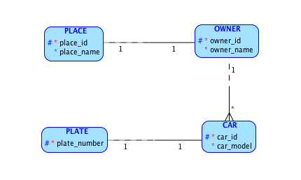

### HW #3 - Resources, URIs, Operations
---
Data model:  
  
URIs:  

*  __/owner__ - list of owners  
	HTTP method: GET  
	Status codes: 200 - ok, 400 - bad request  
*  __/owner?=<owner_id>__ - return info about certain owner(his places and cars)  
	HTTP method: GET  
	Status codes: 200 - ok, 400 - bad request, 404 - Not found  
	HTTP method: DELETE  
	Status codes: 202 - accepted, 400 - bad request, 404 - Not found  
	HTTP method: POST  
	Status codes: 202 - accepted, 400 - bad request  
	HTTP method: PUT  
	Status codes: 200 - ok, 400 - bad request, 404 - Not found 
*  __/place__ - list of places  
	HTTP method: GET  
	Status codes: 200 - ok, 400 - bad request
*  __/car__ - list of cars  
	HTTP method: GET  
	Status codes: 200 - ok, 400 - bad request
*  __/plate__ - list of plates  
	HTTP method: GET  
	Status codes: 200 - ok, 400 - bad request
